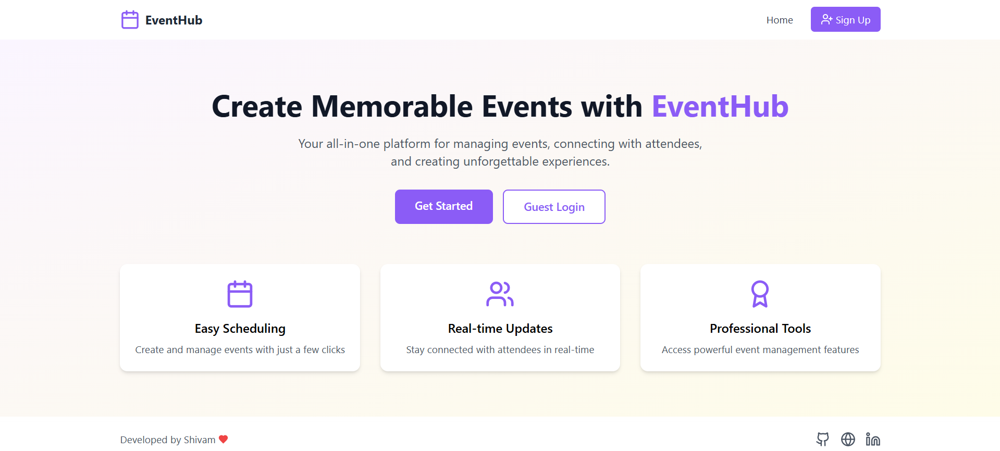
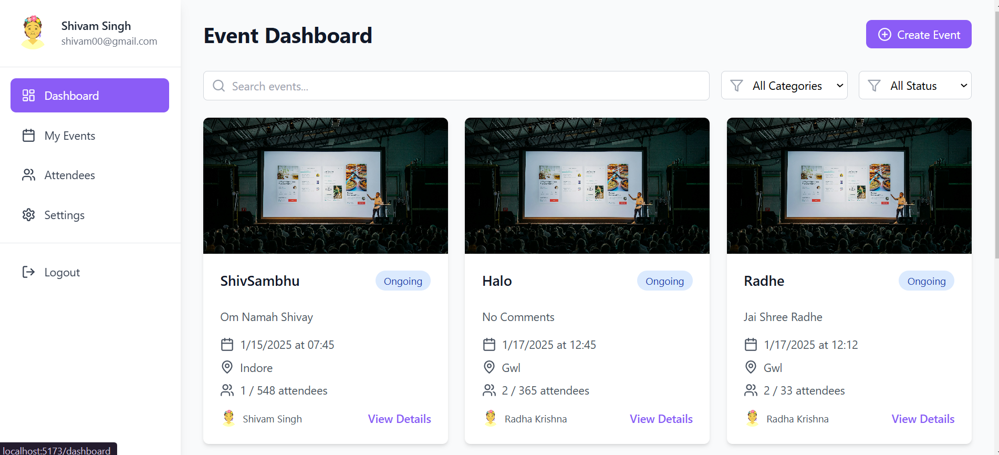
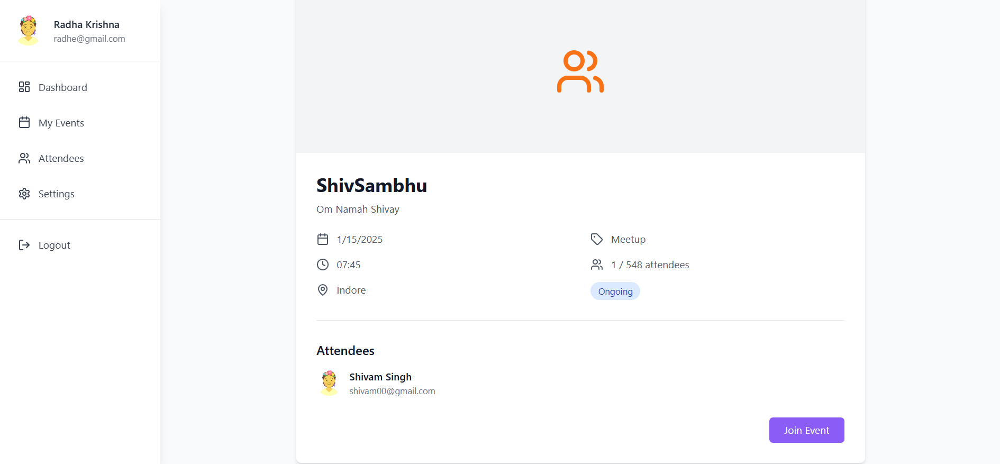
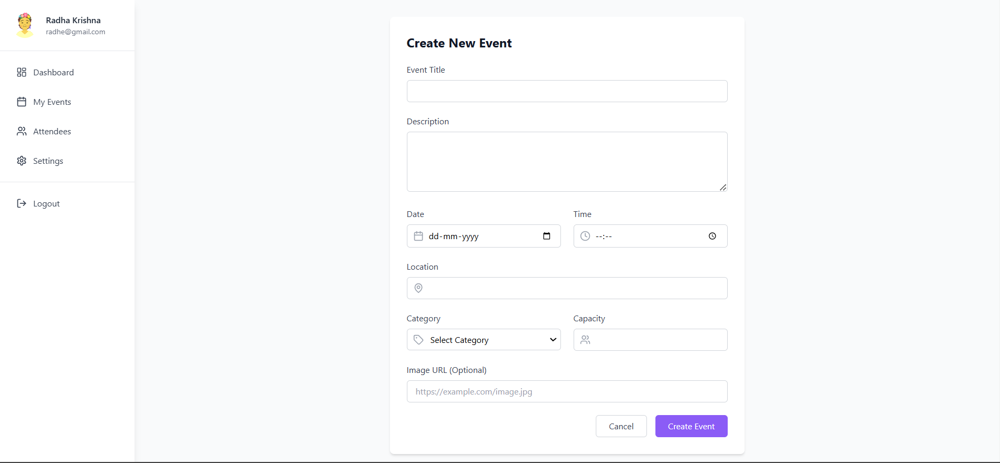

# 🌟 EventHub - Your Ultimate Event Management Platform

EventHub is a modern, feature-rich platform designed to simplify event creation, management, and participation. Built using cutting-edge technologies, EventHub offers a seamless experience for both organizers and attendees.

🔗 **Live Demo**: [EventHub](https://event-hubz.vercel.app/)\
🌍 **GitHub Repository**: [EventHub on GitHub](https://github.com/shibbu04/Eventra)

---

## 🚀 Key Features

### 🔐 **User Authentication**

- Secure email/password-based login
- Profile management with avatars

### 🗓️ **Event Management**

- Create and manage events effortlessly
- Real-time updates powered by WebSocket
- Categorize events (Conference, Workshop, Seminar, Meetup)
- Track event statuses (Upcoming, Ongoing, Completed)
- Manage attendee capacity effectively
- Rich event details including date, time, location, and descriptions

### 📊 **Dashboard Features**

- Overview of all events
- Personal events section
- Manage attendees with ease
- Powerful filtering and search options
- Fully responsive design for all devices

### 🔄 **Real-Time Features**

- Live updates for event changes
- Instant notifications for new events
- Real-time attendee list updates

---

## 🛠️ Tech Stack

### **Frontend**

- ⚛️ React.js with TypeScript
- 🎨 Tailwind CSS for styling
- 📡 Socket.IO Client for real-time features
- 🧭 React Router for navigation
- 🔤 Lucide React for icons

### **Backend**

- 🟢 Node.js with Express
- 🍃 MongoDB with Mongoose
- 📡 Socket.IO for real-time communication
- 🔐 JWT for secure authentication
- 🌐 CORS for cross-origin resource sharing

---

## 📂 Project Structure

```plaintext
Eventra/
├── frontend 
│   ├── src/                 # Frontend source files
│        ├── components/
│        ├── config/              # Reusable React components
│        ├── pages/              # Page components
│        │   └── Dashboard/      # Dashboard-related pages
│        └── main.tsx            # Application entry point
├── backend/                # Backend source files
│   ├── src/
│   │   ├── config/         # Configuration files
│   │   ├── models/         # MongoDB models
│   │   ├── routes/         # API routes
│   │   └── index.js        # Server entry point
│   └── package.json
└── package.json
```

---

## 🚀 Getting Started

### 🧰 Installation

1. Clone the repository:

   ```bash
   git clone https://github.com/shibbu04/Eventra.git
   cd Eventra
   ```

2. Install dependencies for both frontend and backend:

   ```bash
   # Install frontend dependencies
   cd frontend
   npm install

   # Install backend dependencies
   cd backend
   npm install
   ```

3. Set up environment variables:

   - Create a `.env` file in the `backend` directory with the following variables:
     ```env
     MONGODB_URI=your_mongodb_connection_string
     JWT_SECRET=your_jwt_secret_key
     FRONTEND_URL=http://localhost:5173
     PORT=5000
     ```
        - Create a `.env` file in the `frontend` directory with the following variables:
     ```env
     VITE_API_URL=http://localhost:5000
     ```

4. Start the development servers:

   ```bash
   # Start backend server (from backend directory)
   npm start
   # Start frontend server (from root directory)
   npm run dev
   ```

### 🌐 Access the Application

- **Frontend**: [http://localhost:5173](http://localhost:5173)
- **Backend**: [http://localhost:5000](http://localhost:5000)

---

## 📸 Screenshots

| Home Page | Dashboard |
| --------- | --------- |
|| |

| Event Details | Create Event |
| ------------- | ------------ |
||              |

---

## 💌 Contact

Have questions or suggestions? Reach out!

- **Author**: Shivam Singh
- 📧 Email: [shivamsingh57680@gmail.com](mailto\:shivamsingh57680@gmail.com)
- 🐙 GitHub: [@shibbu04](https://github.com/shibbu04)
- 🌐 Website: [shivam04.tech](https://shivam04.tech)

---

Enjoy using **EventHub** and make your events extraordinary! 🎉

